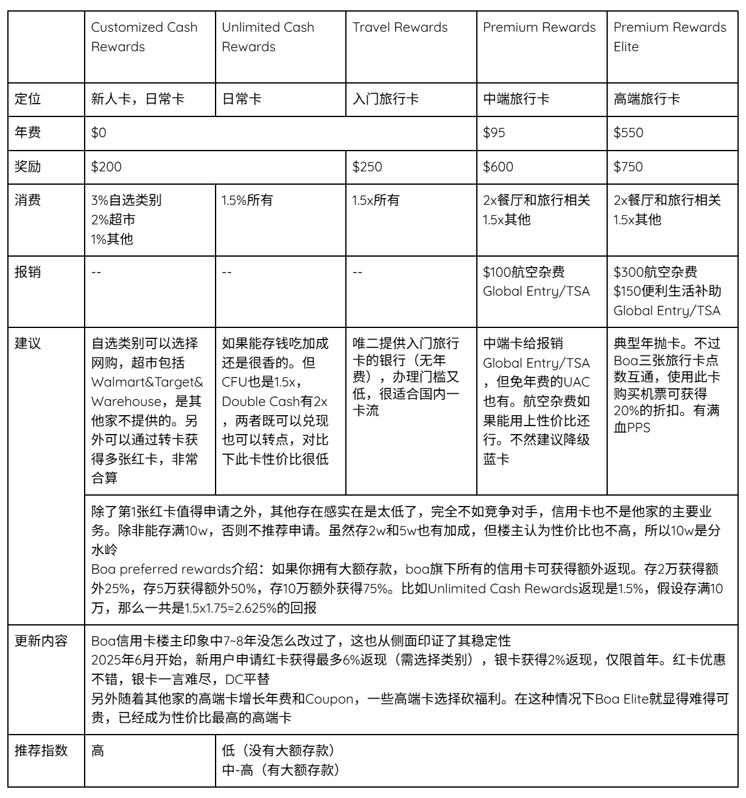

# 信用卡全面对比整理

<aside>

【2025.07】2.5版本（XHS未发布），更新了银行的一些卡

SYW已绝版，目前无法申请

【2025.05】2.0版本发布，更新了银行的一些卡

【2025.01】1.0版本发布

</aside>

## 简介内容

六个月前，楼主总结了关于美国各大银行的信用卡。由于变化多端，很多信息难免过时。所以这期继续给大家总结更新，包括Bank of America，Chase，Citi，Amex，Discover，Capital One，USBank，Well Fargo。以后可能会不定时更新，但不对未来的改变负责。

### 结论分析

由于信息更新，策略相对之前有所改变。标准分为有存款（10w）和其他。

【有存款】

推荐Boa全家桶即可（75%额外加成）。缺点就是没有Primary保险，再补一张CSP就够了。另外由于USBank进行削弱，不再推荐Smartly。

【无存款】

八卡策略性价比仍然很高，感兴趣的可以去考古一下。省流：Boa123+Chase&Citi三剑客+Bilt+UAC。另外随着Discover正式被C1收购，不再推荐作为信手卡申请。

### 核心策略

点数可以兑现，现金不能兑点。其中UR，TYP可以1cpp兑现，随意入。但Amex，C1兑现均低于1cpp，就需要考虑清楚点数是否能用得上了。

如果觉得八卡还是太多，可以考虑根据自己的需求二次精简。首先要彻底了解自己的需求，八卡覆盖的类别是全但前期需要有取舍。清楚自己在哪个类别花销更大，就先下哪个类别对应的卡。

### 注意事项

1. 本攻略只整理了各大银行自家发行的个人卡，并附上一些性价比高的卡，及各大航司/酒店评价。
2. 信息均来自官网。由于信息变化快，楼主不对未来的变化负责，仅供参考。
3. 很多卡有消费上限。比如5x的卡一般季度消费上限$1500，之后1x。
4. 本表格区别卡是返现（%）还是返点（x）。
5. 所有在银行Portal购买旅行相关的产品消费结构均不计入此表格。
6. 不同卡的报销限制不同，建议前往官网查看具体条款。

<aside>

由于Notion不支持合并单元格，所以只能放图片了

</aside>

## Bank of America

## Chase

## Citi

## Amex

## Discover

|  | Discover it |
| --- | --- |
| 定位 | 新人卡，日常卡 |
| 年费 | $0 |
| 奖励 | $100 |
| 消费 | 5%季度轮换
1%其他 |
| 报销 | -- |
| 建议 | 现在楼主不推荐Discover作为新人卡
有一个缺点是他们会随机抽查，需要提供相关文件证明。如果拿不出来可能会被关户，这点挺烦的。
另外的卡就不介绍了，没啥可玩性 |
| 更新内容 | 已正式被C1收购，以后恐怕是有臭名昭著的3HP了。想一想你是新手一上来就吃了3HP… 这还有得玩吗？ |
| 推荐指数 | 低 |

## Capital One

## USBank

## Well Fargo

|  | Attune | Active Cash | Autograph | Autograph Journey |
| --- | --- | --- | --- | --- |
| 定位 | 日常卡 | 日常卡 | 日常卡 | 中端旅行卡 |
| 年费 | $0 | $0 | $0 | $95 |
| 奖励 | $100 | $200 | 20k | 60k |
| 消费 | 4%体育馆会员&美容美发&娱乐&运动&公共交通&充电&旧货店
1%其他 | 2%所有 | 3x餐厅&旅行相关&加油&流媒体&手机计划
1x其他 | 5x酒店
4x机票
3x餐厅&旅行相关
1x其他 |
| 报销 | -- | -- | -- | $50机票 |
| 建议 | 消费结构独特程度仅此一张，这是给喜欢演唱会的人准备的吧？ | DC平替，你是有多想不开来申请这个？ | 有点意思，也就这张性价比可以，有3x的加油，另外旅行相关的定义也比较广泛 | 也就那样了，当返现卡用吧。值得一提的是履行相关不包括Transit，定义比Autograph窄 |
| 推荐指数 | 低 | 低 | 中 | 中 |

你在网上大概都搜不到WF卡的介绍，实在是冷门到无人问津，第一版里面楼主甚至都没有包括。考虑到还是有需求所以添加了这个板块，总体看下来只有一张Autograph性价比不错。

另外转点伙伴方面，千万别对WF抱有太大期待。大家按照返现卡使用即可。

## Special

|  | Bilt | Robinhood Gold |
| --- | --- | --- |
| 定位 | 日常卡(房租卡，中端旅行卡) | 日常卡 |
| 年费 | $0 | $0（但是需要会员，年费$60） |
| 奖励 | $0 | $0 |
| 消费 | 3x吃饭
2x旅行相关
1x其他 | 3%所有 |
| 发卡行 | Well Fargo | -- |
| 建议 | 虽然没有开卡奖励，但作为市面上唯一的房租/房贷卡，还是很值的
也支持以保底1.25cpp定旅行相关产品。不过要吐槽一下点数会去尾 | 3%所有还无FTF国内刷非常香。但需要排队排很久，且只对gold会员开放。所以即使是没有年费但是会员一年$60
另外CEO在接受采访时，不能保证未来18个月是否能有3%所有消费。 |
| 更新内容 | 也就这短短几个月Bilt的变化很多。之前甚至更新了通过Bilt portal再不需要Bilt卡的情况下可获取1x Bilt积分+信用卡本身的积分，但是要付手续费。当然很明显已经被玩坏了，所以Bilt准备砍到0.5x。
有些人觉得没有再申请Bilt的必要了，但是如果寄支票的话必须使用Bilt卡，而市面上也没有替代品（主要还是省事）
另外WF已经赔了很多钱，想要尽早做甩手掌柜。预计2026年2月Bilt将迎来新发卡行，推出年费版本。但新发卡还真的很一言难尽 | 很多人排队到天荒地老。这张卡的定位确实很尴尬，需要的时候decline，不需要的时候放抽屉。有人反映说交税之类的压根就不给点数，就是玩不起。总体来说适合中老年人一卡流，不然按照之前楼主的思路这张卡基本上没什么用。另外没有开卡奖励也是硬伤 |
| 推荐指数 | 高（对于有房租/房贷的人）
低（对于没有房租/房贷的人） | 一般人申不到 |

## Co-Brand

|  | Alaska | AAdvantage Platinum Select | Marriott Bonvoy Boundless | World of Hyatt |
| --- | --- | --- | --- | --- |
| 定位 | 旅行卡 | 旅行卡 | 旅行卡 | 旅行卡 |
| 年费 | $95 | $99（首年免费） | $99 | $95 |
| 奖励 | 60k | 50k | 3FN | Up to 60k |
| 消费 | 3x Alaska
2x加油&交通&网络&订阅服务
1x其他 | 2xAA&餐厅&加油
1x其他 | 6x万豪酒店
3x加油&超市&餐厅
2x其他
——
17x最高万豪酒店消费（6x基础+10x部分万豪酒店+1x银卡会员） | 4x凯悦酒店
2x餐厅&机票&公共交通&体育健身
1x其他
——
9x最高（4x基础+5x会员身份） |
| 发卡行 | Bank of America | Citi | Chase | Chase |
| 报销 | $100 Alaska Lounge+ Membership | -- | -- | -- |
| 福利 | 20%机上购买折扣
每年奖励10%点数（需持有Boa checking）
免费托运一件行李 | 25%机上购买折扣
免费托运一件行李 | 1FN(Up to 35k) | 每年送FN x 1
每年消费1.5w再送FN x 1 |
| 建议 | AS是最值钱的里程之一了，非常实用。自从收购夏威夷航空后，从7月份起Amex就不能再转点了，从此以后只接受Bilt。点数来源稀少。 | AA一共有三张联名卡，这张在中间。楼主认为性价比最高，也是大多数人开AA的首选。AA里程同样来源稀少且珍贵，据说明年接受TYP转点。没有报销，但是首年免年费，第2年不用了降级 | 万豪的分本身不值钱，但是酒店数量最多，经常出差可以考虑。另外此卡一年之后可以考虑升级Ritz（粟子），也可以降级至无年费卡，比较灵活。 | 每年只要交免费就送1FN cat 1-4, 相当于花$95购买了价值上限平均约$250的酒店，每年只要能住一晚就能负年费。
另外酒店覆盖率不如万豪，优点是点数价值是所有酒店集团里最高的。大家应该攒了不少UR吧？毕竟是唯二把UR用出高价值的方式了。 |
| 更新内容 | 最近有人能刷出75k的奖励。另外听说暑假要出一张高端卡，敬请期待 | 截至发稿前，官网有80k石膏奖励。考虑到马上TYP就能转AA了，可预见的是贬值。楼主严重怀疑贬值前再圈一波钱。航空里程不能囤！ | 截至发稿前，5FN的开卡奖励已过期。不过值得吐槽的是最近万豪点数又贬值了，很多人抱怨FN很难用 | 联名卡的开卡奖励千变万化。截至发稿前，这张卡的开卡奖励变成了史低。看了这么多联名卡，真的也就只有Hyatt敢这样了 |

既然楼主把这些联名卡挑出来并且放在了这里，证明都是性价比很高的联名卡。但是性价比高是建立在有需求的基础上，没有需求千万不要乱开联名卡！

## 其他联名卡航司&酒店评价

### 航空公司

**达美航空**

空中冥币实至名归（回国经常需要百万里程）。另外之前出了一篇文章，达美居然使用Amex提供额度为11亿美元的信用卡购买航空燃油，每月付款。空中冥币的原因找到了...

**美联航**

紧随其后，也快成为第2个空中冥币的公司了。不排除有时会找到性价比高的票，但在美国境内用出1.2cpp就很好了。另外UA信用卡最近刚改版，增加了年费和Coupon Book，非常讨厌。如果经常坐可以考虑，但是如果想冲着里程票去就放弃吧。

**西南航空**

宣布取消了免费托运行李，泪奔。点数价值中规中矩。绝对刚需可以考虑（比如有人反映每周都要飞一次SW，如果需要免费托运行李办卡很有用）。

**阿拉斯加航空&美国航空**

表格中已经介绍过。目前航空界最值钱的里程之二且来源稀少，也可以出其他航司的票，需要上车绝对不亏。

**加拿大航空**

由于引入了动态换票，褒贬不一。根据反馈，界面好用，价格也比UA划算（肯定的UA都不懂贬值到哪去了）。之前为了防止票代，系统默认屏蔽了飞往亚洲的票。不过现在好消息是解除了对中国内地和香港的部分机票的搜索屏蔽。劣势方面退票没有UA方便。鉴于星空应该是最团结的一个联盟，如果能用上这张卡性价比很高。

### 酒店

**万豪**

点数价值低，尤其在美国境内贬值严重（根据反映美国之外还不错）。很多人都是冲着Ritz（栗子卡）去的。但是如果不住万豪，栗子卡的性价比也很低。

**凯悦**

点数价值最高的酒店没有之一，因为大多数为自营品牌所以质量普遍较高（但是就真实情况来看未必）。本身信用卡的性价比有，但最多就是95换1FN而已，Cat1-4在美国境内未必好用（根据反馈）。相信大家有非常多的UR，如果一年只旅行几次UR转点应该够用了（更何况大家不要老盯着转点，有时候Airbnb性价比更高）。

**洲际**

点数价值同样一言难尽。根据网上反馈，IHG门店数量在美国其实不占优，主要分布在一些著名景区和国家公园。另外听说在欧洲是主场。如果从性价比的角度来说，联名卡的优先程度确实不如另外几家酒店。但是联名卡其实并没有性价比这一说，能用上就是最好的。

**希尔顿**

点数价值最低的酒店，再配上Amex恶心的Coupon Book。高端卡已经砍掉PPS，楼主认为性价比不高（对于大部分人，因为讨论度也不高）。但是好用的人是觉得真好用，这里不做评价。

## 申请建议

虽然楼主在强调联名卡不适合大多数人，按需申请。但楼主本身确实对联名卡毫不感冒，也有可能是偏见或绝对的理智。如果你的两年八卡申完了，接下来可以怎么玩？楼主会申请一些别的卡然后通过转卡获得多张Boa123，CFF，CC等。如果Robinhood排到了可能会接...

## 免责声明

以上意见是在楼主采集了不同人的想法和翻阅许多文章得出的，不代表最后观点。联名卡的争议非常大，好用是真好用，不好用是真不行。自己用的舒服就行了，不接受对以上内容的争议。

<aside>

XHS原文章

[http://xhslink.com/m/6JOpbS07ibk](http://xhslink.com/m/6JOpbS07ibk)

另外也可以参考1.0版本，未在博客发布

[http://xhslink.com/m/46Oe6DdXxEx](http://xhslink.com/m/46Oe6DdXxEx)

</aside>